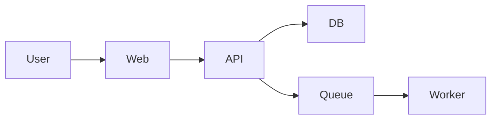

# Documentation Blueprints

Use these structures as defaults. Trim sections that do not fit the repository, but do not omit important material just to stay short.

## Global index: `.agents/project/documentation-index.md`

Recommended sections:

```md
# Documentation Index

## Project docs
- [Project Overview](./project-overview.md)
- [Architecture](./architecture.md)
- [Tech Stack](./tech-stack.md)
- [Gap Analysis](./gap-analysis.md)

## Operational and domain docs
- Add links to the optional docs that exist

## Local scope docs
- Link to nested `.agents` directories in apps, packages, services, or features

## Update guidance
- When to update these docs
- Which files are the source of truth for each section
```

## Core file: `project-overview.md`

Recommended sections:

```md
# Project Overview

## Purpose

## Primary users and stakeholders

## Main capabilities

## Repository shape

## Deployable units

## Critical workflows

## Documentation map
```

## Core file: `architecture.md`

Recommended sections:

```md
# Architecture

## Summary

## System boundaries

## Main modules or services

## Request and data flows

## Integrations

## Deployment view

## Risks and hotspots
```

Add Mermaid diagrams when useful, for example:



## Core file: `tech-stack.md`

Recommended sections:

```md
# Tech Stack

## Languages and runtimes

## Frameworks and application libraries

## Build and package tooling

## Data and persistence

## Infrastructure and deployment

## Observability and operations

## Testing tooling

## Developer tooling
```

## Core file: `gap-analysis.md`

Recommended sections:

```md
# Gap Analysis

## Existing docs worth keeping

## Missing docs

## Outdated docs

## Proposed local `.agents` scopes

## Open questions

## Assumptions used in this pass
```

## Optional file: `repository-map.md`

This is the high-signal version of a "directory map".
Use it when the repository is large enough that a newcomer or an agent needs a guided map of the important folders.

Recommended sections:

```md
# Repository Map

## Top-level layout

## Important apps, services, packages, or domains

## Shared utilities and foundations

## Generated or vendor directories to ignore

## Ownership and change hotspots
```

Keep it architectural. Do not turn it into a full file listing.

## Optional file: `api-contracts.md`

Document:

- Exposed HTTP, GraphQL, gRPC, RPC, or webhook surfaces
- Versioning or compatibility rules
- Schema sources of truth
- Auth expectations
- Consumer-facing invariants

## Optional file: `data-model.md`

Document:

- Main entities and relationships
- Persistence technologies
- Migration strategy
- Important derived data or warehouse models
- Data ownership boundaries

## Optional file: `integrations.md`

Document:

- Third-party services
- Internal service-to-service dependencies
- Auth method per integration
- Failure modes and fallback behavior

## Optional file: `auth-and-security.md`

Document:

- Authentication providers and flows
- Authorization model
- Role or permission boundaries
- Sensitive data handling
- Secrets and environment concerns

Do not leak secret values.

## Optional file: `deployment-and-environments.md`

Document:

- Environments
- Deployment platform
- Environment variables by class
- Release flow
- Operational caveats

## Optional file: `testing-strategy.md`

Document:

- Test pyramid or testing layers
- Frameworks and commands
- What is intentionally untested
- Mocking and fixtures strategy
- CI gates

## Optional file: `observability.md`

Document:

- Logging
- Metrics
- Tracing
- Error reporting
- Dashboards and alert ownership

## Optional file: `business-rules.md`

Document:

- Domain invariants
- Validation rules
- Billing, entitlement, compliance, or workflow constraints
- Rules that are easy to break during refactors

## Optional file: `onboarding.md`

Document:

- Local setup
- First commands to run
- Where to start reading
- Common pitfalls
- How to make a safe first contribution

## Optional file: `troubleshooting.md`

Document:

- Frequent errors
- Likely causes
- Debug commands
- Known flaky areas
- Escalation notes

## Optional file: `glossary.md`

Document:

- Domain vocabulary
- Internal abbreviations
- Terms that appear in code but are not obvious

## Optional directory: `adr/`

When architecture decisions are important or disputed, create:

- `adr/README.md`
- `adr/0001-<short-title>.md`

Suggested ADR structure:

```md
# ADR 0001: Title

## Status

## Context

## Decision

## Consequences
```

## Frontend-specific file: `design-system.md`

Create this when the repo has shared UI primitives, a component library, theming, or a reusable visual language.

Recommended sections:

```md
# Design System

## Purpose and scope

## Shared UI primitives

## Component composition patterns

## Layout and spacing rules

## Typography

## Color usage

## Accessibility expectations

## Source of truth files
```

## Frontend-specific file: `design-tokens.md`

Create this when tokens exist in CSS variables, Tailwind config, JSON token files, theme objects, or similar sources.

Recommended sections:

```md
# Design Tokens

## Token sources

## Colors

## Typography

## Spacing and sizing

## Radius, shadows, and motion

## Breakpoints

## Token usage rules
```

Prefer referencing actual token source files over manually duplicating long token tables if the token set is large.
